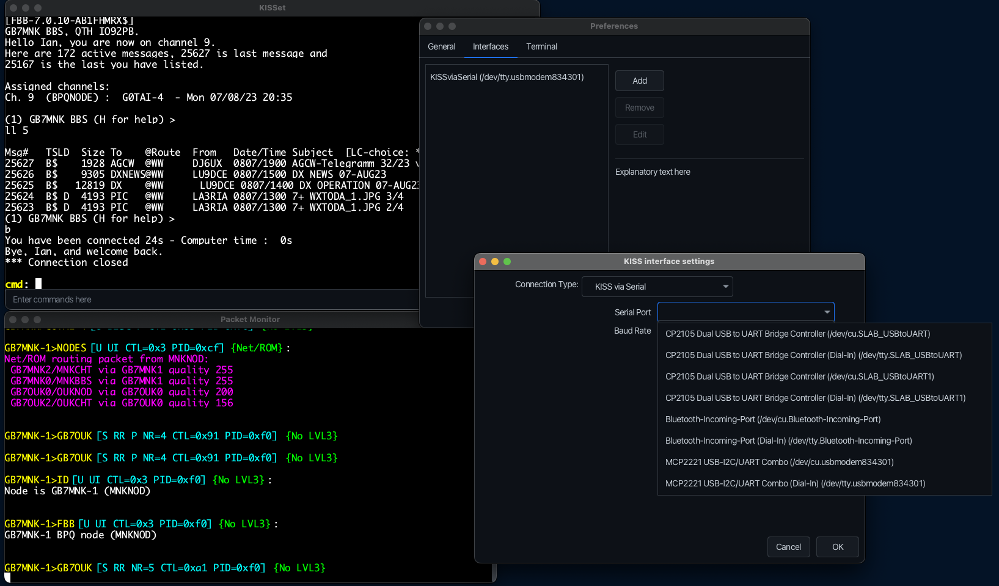

# KISSet

A terminal program for connecting to a TNC or modem that only support the KISS protocol (NinoTNC, TH-D74, etc)

### Installers/Packages

Releases are available for: <a href="https://github.com/piemmm/KISSet/releases/tag/windows-latest">Windows</a> (.exe file)
 <a href="https://github.com/piemmm/KISSet/releases/tag/ubuntu-latest">Linux</a> (.deb file)
 <a href="https://github.com/piemmm/KISSet/releases/tag/macos-latest">Macos</a> (.dmg file)

### Building from source

KISSet uses Bellsofts liberica jdk which has java-fx bundled in. If you require to use a different jdk, you will need to install java-fx separately or add the dependencies to the pom.xml

### Next Planned features / Todo

* Remember remote connecting users colour choices for ANSI colour support
* Access control for the PMS system
* Finish Net/ROM support
* Multi window mode
* Flashing/notification icon/system tray icon for new PMS messages
* Interface statistics window

